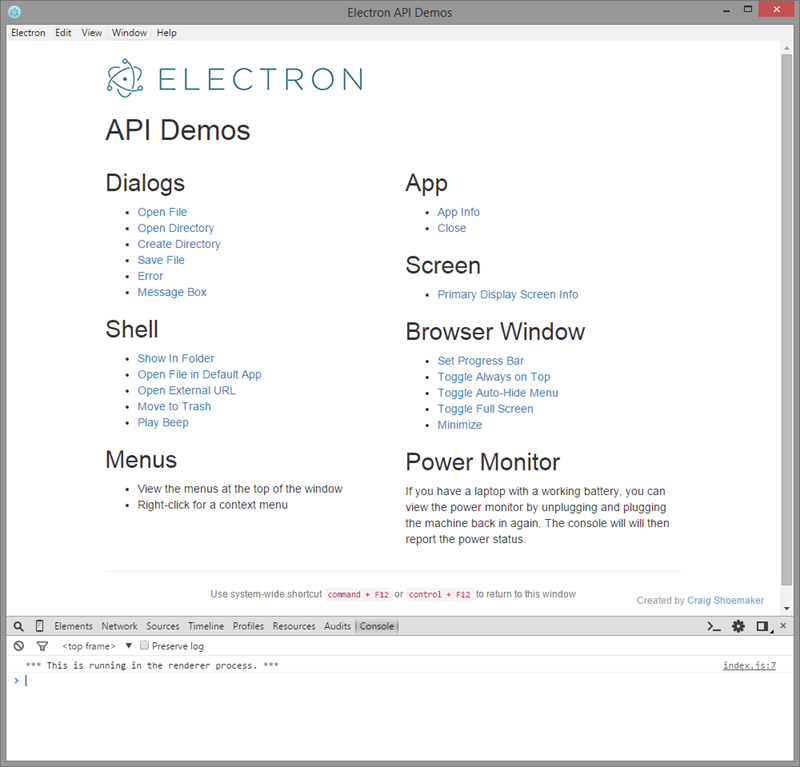

# Electron API Demos

This project contains a number of demos to help you explore the [Electron](http://electron.atom.io/) API.



## Setup

To setup the demos clone this repository:

``` shell
$ git clone https://github.com/craigshoemaker/electron-api-demos.git
```

Then install the main process modules:

``` shell
$ npm install
```

Then install the renderer process dependencies:

``` shell
$ cd app
$ npm install
$ bower install
```

# Run the Demos

To run the demos, you simply execute:

``` shell
$ npm start
```

To debug, first start node-inspector:

``` shell
$ node-inspector
```
then, in another console window run the `test` command :

``` shell
$ npm start-debug
```
